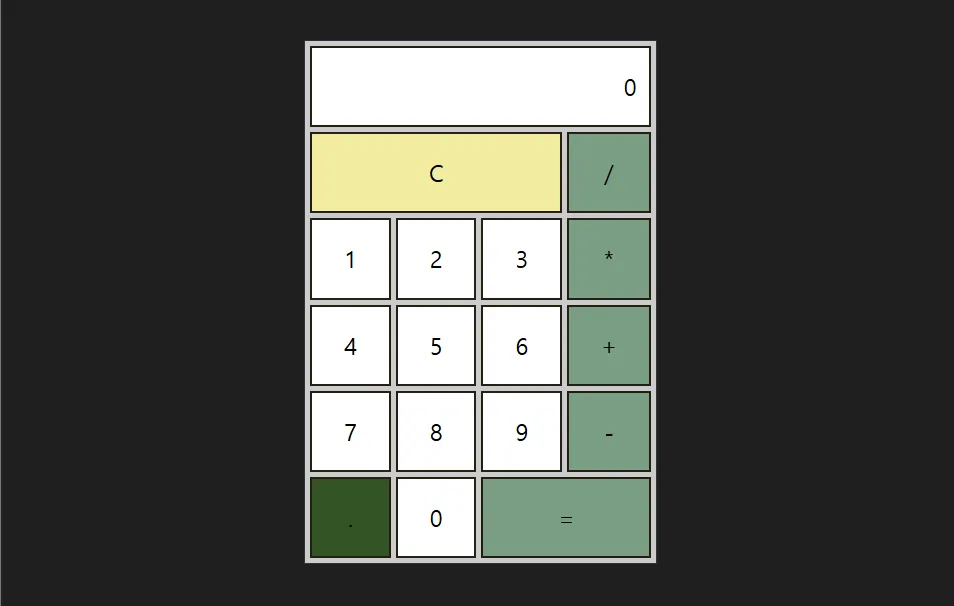

# 4주차 리액트

## 섹션 9. 계산기 만들기

### 리액트 개발자 도구 설치

- Chrome Web Store에서 **React Developer Tools** 설치
- 개발자 툴에서 **`Components`** 탭과 `Profiler` 탭을 사용할 수 있게 됨
  - profiler는 성능과 관련된 지표를 확인할 때 쓰임
  - components는 컴포넌트에 대한 내용을 쉽게 확인할 수 있음

### 구조 관련 팁

- 컴포넌트 내부에서 정의한 함수들은 모두 React와 관련되어 있는 기능들을 활용하는 함수
  - 이벤트 핸들러, 상태 업데이트 함수 등
- 컴포넌트 외부에는 리액트 기능을 사용하지 않는 함수나 변수 등 정의
  - 구조를 깔끔하게 하기 위해 별도의 폴더에 작성해도 됨
